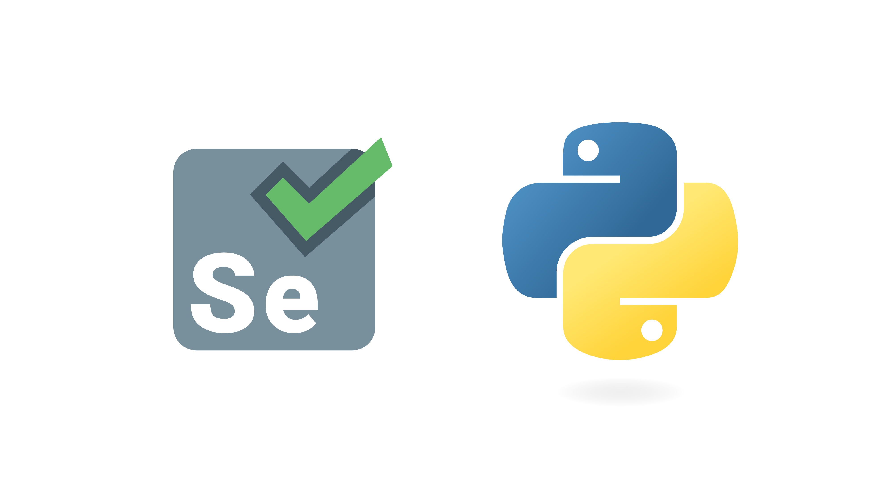
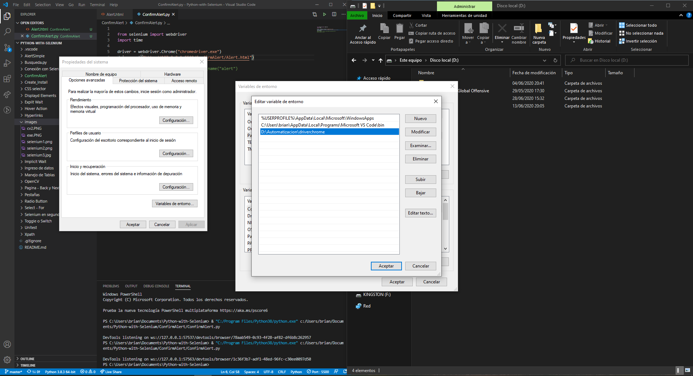
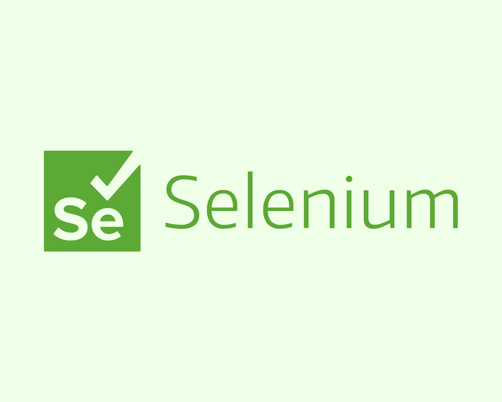

<h2 align="center">Python with Selenium</h2>

<p align="center">
  
   </a>
    
  </a>
  <a href="https://github.com/BrianMarquez3/Python-with-Selenium/stargazers">
    
  </a>
  <a href="https://github.com/BrianMarquez3/Python-with-Selenium/network">
    
  </a>
    
  </a>
  
  </a>
    
  </a>
  
  </a>
    
  </a>
  
   </a>
   <a href="https://github.com/BrianMarquez3/Python-with-Selenium/network">
    
  </a><br>
 
  
  
  
</p>




## Descripción 🔥

_Selenium es un entorno de pruebas de software para aplicaciones basadas en la web. Selenium provee una herramienta de grabar/reproducir para crear pruebas sin usar un lenguaje de scripting para pruebas (Selenium IDE). Incluye también un lenguaje específico de dominio para pruebas (Selanese) para escribir pruebas en un amplio número de lenguajes de programación populares incluyendo Java, C#, Ruby, Groovy, Perl, Php y Python. Las pruebas pueden ejecutarse entonces usando la mayoría de los navegadores web modernos en diferentes sistemas operativos como Windows, Linux y OSX._

### Historia 📋

_Selenium fue originalmente desarrollado por Jason Huggins en 2004 y pronto se unieron al esfuerzo otras personas especialistas en pruebas y programación. Es un software de código abierto bajo la licencia apache 2.0 que puede ser descargada y usada sin cargo. El nombre proviene de una broma hecha por Huggins burlándose de un competidor llamado Mercury (mercurio) diciendo que el envenenamiento por mercurio puede ser curado tomando complementos de Selenio. Los participantes tomaron el nombre y siguieron con él. Existen otros proyectos que se desarrollan alrededor de Selenium como Selenium Grid, para probar concurrencia de múltiples pruebas concurrentes de clientes remotos o locales, así como Flash Selenium para probar programas escritos en Adobe Flex o Selenium Silverlight._

### Instalación 🔧

_Instalar Previamente Python desde la página Oficial_
* [Instalador](https://www.python.org/) - Python

_Verifica la versión de Python_

```
python --version
```

_Instalacion de Selenium_

```
pip install selenium
```

_Actualiza el  PIP de Python_

```
python -m pip install --upgrade pip
```

_Instalacion de CV2_

```
pip install opencv-python
```


_Creacion de un .exe_

```
pip install pyinstaller
```


_Listado de Modulos instalados en Python_

```
pip list 
```


_Instalar Pytesseract_

```
pip install Pytesseract
```

_Desinstalar Modulos_

```
pip uninstall nombreModulo
```

_Html-TestRunner_

```
pip install html-testRunner
```


## Drivers de Navegadores ⚙️

_Links de descarga de los Principales Navegadores_

* 📦 [Google Chrome](https://sites.google.com/a/chromium.org/chromedriver/downloads) - Driver de Chrome
* 📦 [Mozila Firefox](https://developer.microsoft.com/en-us/microsoft-edge/tools/webdriver/) - Driver de Firefox
* 📦 [Microsoft Edge](https://developer.microsoft.com/en-us/microsoft-edge/tools/webdriver/) - Driver de Microsoft Edge
* 📦 [Safari](https://developer.microsoft.com/en-us/microsoft-edge/tools/webdriver/) - Driver de Safari
* 📦 [Opera Browser](https://github.com/operasoftware/operachromiumdriver/releases) - Driver de Opera
* 📦 [Internet Explorer](https://www.selenium.dev/downloads/) - Driver de IE
* 📦 [Brave Browser](http://mundrisoft.com/tech-bytes/install-selenium-webdriver-windows/) - Info Driver

## Path

Agregar la dirección del Driver al Path para mejorar el llamado del ejecutable


## Xpath - Selenium

XPath se define como una ruta XML . Es una sintaxis o lenguaje para encontrar cualquier elemento en la página web utilizando la expresión de ruta XML . XPath se usa para encontrar la ubicación de cualquier elemento en una página web utilizando la estructura HTML DOM.

### Sintaxis para XPath:

XPath contiene la ruta del elemento situado en la página web. La sintaxis estándar para crear XPath es.

```
Xpath = // tagname [@ attribute = 'value']
```

## Ramas 👾

Ver todas las Ramas [Ramas](https://github.com/BrianMarquez3/Python-Course/settings/branches)

## Autor ✒️

* **Nicolas Alvarez** - *Documentación* - [https://github.com/ksiel99/Python-con-Selenium]()


