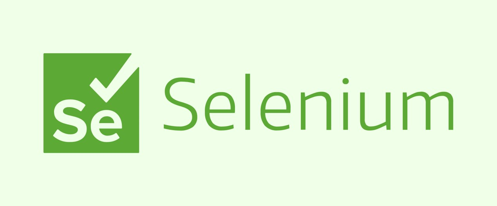

<h2 align="center">Python con Selenium&nbsp;:🖥:&nbsp;</h2>


_Pruebas de Optimación_

## Descripción 🔥 

_Selenium es un entorno de pruebas de software para aplicaciones basadas en la web. Selenium provee una herramienta de grabar/reproducir para crear pruebas sin usar un lenguaje de scripting para pruebas (Selenium IDE). Incluye también un lenguaje específico de dominio para pruebas (Selanese) para escribir pruebas en un amplio número de lenguajes de programación populares incluyendo Java, C#, Ruby, Groovy, Perl, Php y Python. Las pruebas pueden ejecutarse entonces usando la mayoría de los navegadores web modernos en diferentes sistemas operativos como Windows, Linux y OSX._

### Historia 📋 

_Selenium fue originalmente desarrollado por Jason Huggins en 2004 y pronto se unieron al esfuerzo otras personas especialistas en pruebas y programación. Es un software de código abierto bajo la licencia apache 2.0 que puede ser descargada y usada sin cargo. El nombre proviene de una broma hecha por Huggins burlándose de un competidor llamado Mercury (mercurio) diciendo que el envenenamiento por mercurio puede ser curado tomando complementos de Selenio. Los participantes tomaron el nombre y siguieron con él. Existen otros proyectos que se desarrollan alrededor de Selenium como Selenium Grid, para probar concurrencia de múltiples pruebas concurrentes de clientes remotos o locales, así como Flash Selenium para probar programas escritos en Adobe Flex o Selenium Silverlight._

### Instalación 🔧 

_Instalar Previamente Python desde la página Oficial_
* [Instalador](https://www.python.org/) - Python

_Verifica la versión de Python_

```
python --version
```

_Instalacion de Selenium_

```
pip install selenium
```

_Actualiza el  PIP de Python_

```
python -m pip install --upgrade pip
```

## Drivers de Navegadores ⚙️

_Links de descarga de los Principales Navegadores_

* 📦[Google Chrome](https://sites.google.com/a/chromium.org/chromedriver/downloads) - Driver de Chrome
* 📦[Mozila Firefox](https://developer.microsoft.com/en-us/microsoft-edge/tools/webdriver/) - Driver de Firefox
* 📦[Microsoft Edge](https://developer.microsoft.com/en-us/microsoft-edge/tools/webdriver/) - Driver de Microsoft Edge
* 📦[Safari](https://developer.microsoft.com/en-us/microsoft-edge/tools/webdriver/) - Driver de Safari
* 📦[Opera](https://github.com/operasoftware/operachromiumdriver/releases) - Driver de Opera


## Ramas 👾 

Ver todas las Ramas [Ramas](https://github.com/BrianMarquez3/Python-Course/settings/branches)

## Autores ✒️

* **Brian Marquez** - *Documentación* - [Brian Marquez]()


